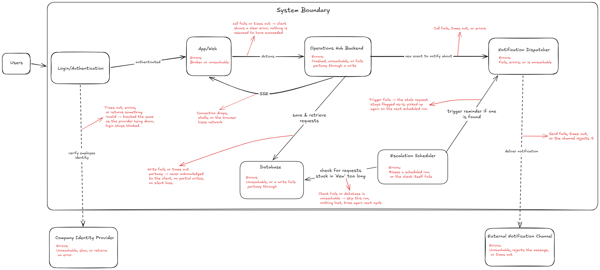

# Architecture: Internal Operations Service Hub

Diagram: 

## 

## 1. Purpose

This service gives employees a single, trackable entry point for internal requests, starting with IT and HR, so that requests are never lost, always
land with the correct owning team, and can be checked on without chasing anyone down. It replaces informal channels like direct messages, hallway conversations, and misdirected emails that currently cause requests to be forgotten or misrouted.

### Requirements driving the design

The main actors are the requester (employee), the owning teams (such as IT or HR), and the System Admin who owns and maintains the hub. The
system has its own dedicated login and a single intake point, with one system of record that can be extended to more categories and teams later.

A few forces shaped almost every design choice below: no request shouldever be silently lost, visibility into a request has to stay strictly limited, status changes belong to the team handling the request ratherthan the person who submitted it, and submitting a request has to feel about as easy as sending a message to a coworker directly.

---

## 2. Structure

### 2.1 Components and responsibilities

**Web and app client.** The single interface everyone uses, with different views depending on role. It handles the submission form including attachments, an open message thread on each request, and a queue view that can be filtered by status, or by category for owning teams and the admin. For owning teams, the queue also shows whether a request is claimed and by whom.

**Login and authentication.** The hub's own login screen. It does not store passwords itself; it hands identity verification off to the company's existing identity provider. After that check succeeds, the hub still refuses the session when the Admin has marked the user inactive, including a token that was issued before they were marked inactive.

**Operations hub backend.** The one core service and the only place business logic lives. It is the entry point every client action passes through, including submitting, asking for an intake suggestion, editing details, messaging, cancelling, claiming, unclaiming, and changing status. It handles routing, status transitions, authorization checks, reassignment, and triggers notifications. It also applies a light per-person limit on creating a request and on posting a message: 5 of each per minute, counted separately. A sixth call in that minute is refused and nothing is saved. The counts live in the backend process. Keeping this as a single service rather than splitting it up avoids the coordination overhead of running several small services, which this system's scale simply doesn't need.

**Intake suggestion (advisory).** A narrow helper used only before a request exists. The backend sends the employee's free-text draft plus the current category, team, and priority lists to an external language model, then rebuilds a structured suggestion the employee can accept, edit, or ignore. The model never writes a request row. Product-owned values (category, team, priority) are checked against the database after the model replies.

**Database.** The persistent record of everything: every request, its full status history, replies, attachments, and priority level. It also holds a small access log: an entry when someone other than the requester — the owning team or the Admin — opens a request's full details, recording who and when. Repeat opens of the same request by the same person within one hour reuse that existing entry rather than writing another. The requester's own views are not logged. This is what makes the system trustworthy as a source of truth rather than a set of scattered messages.

**Notification dispatcher.** Turns internal events, like a new request arriving, a status changing, or a message being sent, into an outbound notification. It skips any recipient the Admin has marked inactive. Message email is quieter than the thread: the first message on a request notifies the other side, and further messages to that same side within two minutes are saved and pushed live without another email. A message after those two minutes sends one email again. The two directions, team and requester, are timed separately. It works independently of the request-writing process, so a slow or failed notification never holds up or undoes the request itself.

**Escalation scheduler.** A background timer that isn't triggered by any person. It periodically checks the database for requests that have sat untouched too long and asks the notification dispatcher to send a reminder to each member of the owning team, skipping members who have personally silenced that specific request and members the Admin has marked inactive. How often it checks and how often it actually reminds are two separate things: it can check frequently without reminding that often, since a reminder for a given request only fires once that request's priority level's escalation window has elapsed since the last reminder sent for it.

### 2.2 External dependencies

**Company identity provider.** An existing system the company already runs for logging people in. The hub relies on it purely to authenticate who someone is; it isn't assumed to also report their team or department, since that varies by provider and isn't something the hub should depend on. If this is unreachable, slow, or returns anything uncertain, the hub blocks login and submission rather than guess.

**External notification channel.** Whichever tool employees already use day to day, such as email or a chat platform, still undecided. The hub hands notifications off to it. If it's unreachable or rejects a message, the request itself is unaffected. The send is retried a few times in-process (three attempts) and then dropped; there is no durable outbox.

**Language-model provider (optional).** Used only for the pre-submit intake suggestion. Today that is Groq's free chat API. If it is unreachable, slow, or returns unreadable output, the employee still submits by filling the form themselves. No other request-lifecycle action depends on it.

No courier, payment processor, or equipment-tracking tool is connected to this hub.

### 2.3 Important data flows

- An employee logs in, which the login screen verifies against the identity provider. They can paste a free-text draft; the backend asks the language-model provider for a structured suggestion, validates it against the Admin-defined lists, and returns that candidate. The employee then submits a request through the client (using the suggestion or filling the form themselves), picking a category from the Admin-defined list, or "Other" with a team picked directly if none fit. That request goes straight to the backend, which validates it, saves it to the database with its status set to New, routes it to the right team based on the category chosen, and tells the notification dispatcher to alert every member of that team, since no individual is assigned to it yet.

- While a request is open, the backend pushes live updates to anyone currently viewing it, whether that's the requester or the owning team, whenever the request is created, the status changes (including cancel), a message is sent, the request is claimed or unclaimed, it is reassigned, or its priority changes.

- When the owning team changes a request's status, the backend checks that the person making the change actually belongs to that team, saves the change, notifies the requester, and pushes the update live to anyone watching.

- A team member can claim an open request, becoming its sole assignee. The backend enforces that only one person can hold a claim at a time; while claimed, only that person can change the request's status, though the rest of the team can still see it and who holds it. Unclaiming clears the assignee and notifies the whole team again, the same as when the request first arrived. Claiming itself doesn't trigger a separate notification, since the team's queue already reflects it live.

- The requester and the owning team can exchange messages on a request at any point while it's still open, not limited to one exchange or gated by status. Each new message is saved and pushed live to anyone watching the request; sending one never changes the status on its own. The backend also tells the notification dispatcher to alert whichever side didn't send the message, since the live push only reaches someone
  actively viewing the request at that moment, not someone who's stepped away.

- If a request was routed to the wrong team, any member of the current owning team can reassign it without needing to open the full details first. The backend moves it to the right team, clears any existing claim so it lands unclaimed in the new team's queue, sets status back to New if it had been In Progress, keeps the original history intact, and notifies the new owner.

- In the background, the escalation scheduler periodically checks for requests that have sat too long without being picked up. The check can run often; it only actually asks the notification dispatcher to remind the owning team once that request's priority level's escalation window has elapsed since its last reminder, sending to each member individually except anyone who has personally silenced that request and anyone the Admin has marked inactive. Silencing is a per-user setting, not a team-wide one, so the rest of the team keeps getting reminded even if one member opts out for themselves. A team member can silence or un-silence a request for themselves at any time; claiming or reassigning it also clears their own silence, so it doesn't quietly persist past the point it was meant for.

---

## 3. Trust, Failure, and Scale

### 3.1 Authorization boundaries

This isn't something drawn as its own box in the diagram. It's a rule the backend checks on every single read and write, never something assumed just because the interface hides an option from view.

- An employee can only see and act on their own requests. A team member can only see and act on requests routed to any team they belong to, but only the current claimant may change a request's status, aside from the requester being able to cancel their own. The requester may edit subject and description only while the request is New and unclaimed; claiming locks those fields even if status is still New. An unclaimed request must be claimed before its status can move at all, though the rest of the team still sees it in the queue along with who holds the claim. Messages follow the team boundary: only the requester and the current owning team can read or add to a request's message thread, at any point while it's still open.

- Attachments can only be edited or removed by whoever uploaded them, and only while the request is still New and unclaimed. Once it is claimed or moves out of New, attachments become read only for everyone, including the uploader.

- Belonging to an owning team doesn't change how someone's own requests are handled. Routing is based only on the category chosen for a given request, never on who submitted it, so a member of the IT team submitting a request of their own is treated exactly like any other employee.

- The Admin can see every request across every team and category, since that's needed for configuring routing and maintaining the hub, but by default only sees the same limited view a receiving team sees on a misrouted request: category, submitter, timestamp, and a short subject line. Full content, including anything sensitive like an HR request, is only shown if the Admin deliberately chooses to open it. This keeps oversight possible without making sensitive details visible by default to someone who doesn't need them for most of their day-to-day work.

- For a request that was routed to the wrong team and contains sensitive information, the receiving team can see enough to recognize it doesn't belong to them, like the category, who submitted it, when, and a short subject line, without the backend requiring them to open the full details first. Choosing to open it anyway is a human decision the system can't prevent.

- Opening a request's full details is logged when the viewer is not the requester (owning-team member or Admin). That does not prevent the access; it only records who opened it and when, because the system cannot tell a correctly-routed view from a misrouted one at that moment. The same person opening the same request again within one hour is not logged again and is not asked to confirm again. The requester's own views are not logged. The log is visible only to the Admin. Someone with no relationship to the request cannot open it at all, not even the limited view.

### 3.2 Failure scenarios

Each piece below lists what can go wrong and what the system does about it.

- **Login and authentication**: unreachable, slow, or erroring. Login is blocked and a clear error is shown.

- **App and web client**: unreachable or broken. Nothing can be submitted or viewed, but nothing already saved is affected.

- **Operations hub backend**: crashed, unreachable, overloaded, or fails partway through a write. The request is rejected outright rather than partially completed or passed through in an uncertain state.

- **Database**: unreachable, or a write fails partway through. The write is rejected and the user is told clearly, rather than the system pretending it succeeded.

- **Company identity provider**: unreachable, slow, or returns an error. Login and submission stay blocked rather than the system guessing who someone is.

- **Notification dispatcher**: fails, errors, or is unreachable. The request stays saved as normal; the notification is retried a few times in-process and then dropped.

- **External notification channel**: unreachable, rejects the message, or times out. Same response as above, the request is unaffected either way.

- **Language-model provider**: unreachable, times out, or returns text that is not valid JSON / uses unknown ids. The suggestion call fails with a clear error; no request is created. The employee can still submit using the ordinary form.

- **Escalation scheduler**: misses a scheduled run, or the check itself fails. Nothing is lost, it simply checks again next cycle.

The connections between these pieces can fail on their own too, even if both sides are otherwise healthy:

- **Client to backend**: call fails or times out. The client shows a clear error, nothing is assumed to have succeeded, and nothing is silently forwarded in an uncertain state.

- **Backend to database**: write fails or times out partway. It is never acknowledged to the client as successful, this is the core guarantee against losing a request.

- **Login to identity provider**: times out, errors, or returns something invalid. Treated the same as the provider being down, login stays blocked.

- **Backend to notification dispatcher**: call fails. The request stays saved regardless; only the notification is retried in-process.

- **Notification dispatcher to external channel**: send fails, times out, or is rejected. Retried a few times on its own, never touches the already-saved request.

- **Backend to client, the live update connection**: drops or stalls. The browser reconnects automatically, and opening a request always fetches the current state fresh rather than trusting the last thing it received.

- **Escalation scheduler to database**: the check fails or the database is unreachable. The run is skipped, nothing lost, tries again next cycle.

- **Escalation scheduler to notification dispatcher**: the trigger fails. The stale request stays flagged and gets picked up again on the next run.

The pattern behind all of this: whenever the system can't be sure a previous step actually succeeded, whether that's a full outage, a timeout, or an unclear response, it treats that the same cautious way it would treat a confirmed failure.

### 3.3 Scalability and reliability notes

Volume is assumed to be low to moderate rather than high-throughput or public facing, and that assumption is why the design stays intentionally small: one backend, one database, no caching layer, no message queue, and no split into multiple services. The escalation scheduler's periodic check only looks at the small slice of requests still sitting as new, so running it every so often adds very little load even at this system's expected scale.

---

## 4. Decisions

### 4.1 Communication decisions

- Every action the client takes, like submitting, editing details, sending a message, cancelling, claiming, unclaiming, or changing status, goes through a normal synchronous call to the backend, since the person needs to know right away whether it worked.

- Live updates flow the other direction, from the backend to the client, over Server-Sent Events (SSE) rather than a fully two-way connection like WebSockets, pushing updates as they happen rather than the client repeatedly asking if anything changed. This fits the traffic pattern this system actually has: per-request live-update volume is expected to be very low, often zero, since many requests move from New to Resolved with a single status change and no messages at all. Updates only ever need to flow backend-to-client, never the other way, since every client action already goes through the normal synchronous calls above. SSE also gives reconnection handling for free, matching the reconnect-and-refetch behavior described in the failure scenarios below, without the added complexity a bidirectional protocol would bring for traffic this light.

- Sending a notification out to the external channel happens asynchronously and separately from saving the request, specifically so a slow or failed notification never delays or blocks the action the person is actually waiting on.

- Creating a request and posting a message are each limited to 5 per signed-in person per minute, inside the backend. The two counts are separate. The sixth call in that minute is refused, so no row is written and no email goes out. The counts are kept in memory for this one process.

### 4.2 Major decisions and rationale

- Keeping everything in one backend service rather than splitting it into several was a deliberate choice. Splitting routing, status handling, and notifications into separate services would introduce coordination overhead this system's scale doesn't call for.

- No caching layer was added. Nothing in the requirements shows a repeated, expensive lookup that would benefit from one, and a cache would
  introduce a second copy of the data that could go stale, which is a real risk with no matching benefit yet.

- Attachments stay inside the database rather than being split into a separate file store. The common practice for file storage is a dedicated object store like S3, with only a reference kept in the database, since it keeps backups lighter and keeps large files from weighing down a database that's meant to be fast at structured queries, not at storing bytes. At this system's expected scale, low to moderate volume, internal use, that overhead isn't worth taking on yet, so files stay in the database for now. The schema is already built so this is cheap to change later: the attachment's file_ref field is typed as a storage key or blob on purpose, so switching to an object store later means changing what that one field points to, not redesigning the schema.

- Categories are defined and maintained by the Admin rather than typed freely by employees, which keeps them consistent and keeps routing reliable. An "Other" option with a directly picked team exists as a deliberate escape hatch for the cases the fixed list doesn't cover, so mandatory categorization (no request left unclassified) doesn't come at the cost of forcing a bad fit. An advisory language-model suggestion can propose a category from that same list before submit; it does not silently classify or create the request. The backend still owns the allowed values, and the employee confirms.

- A person who leaves stays in the hub as an inactive user rather than being deleted. Deleting the row would strip the name off requests, messages, claims, and the access log. Marking them inactive blocks sign-in, including when the identity provider still accepts them, and drops them from notification email. Existing rows that point at them are left as they are. The last active admin cannot be marked inactive, so the hub cannot be left with nobody able to administer it.

- Claiming is exclusive on purpose. With several people on the same team, letting more than one hold a claim on the same request at once would recreate the exact problem it's meant to solve, duplicated or uncoordinated work with nobody clearly accountable for it.

- Escalation reminders can be silenced per person on a specific request, rather than firing indefinitely, and rather than being something one person can turn off for the whole team. Without any silence option, a team member who has genuinely seen a request and is deliberately waiting, not forgetting it, would keep getting treated the same as a request that's actually been missed, which makes the reminder meaningless as a signal. Making it per-user rather than team-wide matters just as much: one person's decision to stop watching something shouldn't be able to silence the safety net for teammates who never agreed to that, so the reminder keeps firing for anyone on the team who hasn't silenced it themselves. Claiming or reassigning the request clears that person's silence automatically, so it can't be used to permanently suppress a request that later needs the reminder again. A global, all-requests notification mute was considered and left out: it would let someone opt out of the escalation safety net entirely and silently, which works against the same guarantee per-request silencing is designed to protect.

- No automatic detection or flagging of repeated reassignments was added. This path only arises when an employee bypasses the category list via "Other" and picks the wrong team directly, which is expected to be uncommon since most requests match an existing category and route correctly on their own. When it does happen, the category and subject line already shown to the receiving team, sometimes backed by a short message exchange, are typically enough to catch and correct it in a single reassignment. The full history stays on the request regardless, so anyone reviewing it, including the Admin, can already see if a request bounced between teams without a dedicated tracking mechanism.

- Priority is a fixed, Admin-defined list (e.g. Low, Normal, Urgent) picked by the requester at submission, the same pattern used for categories, rather than a free-text due date. A free-text or requester-set due date was considered and left out: with no cost to marking a request urgent, requesters would have an incentive to mark everything urgent, which would make the field meaningless as a signal. Fixed tiers avoid that, and any member of the owning team, not only the claimant, can adjust the priority after seeing the request, since they're better positioned to judge real urgency than the submitter, and triaging urgency is useful as a shared, early judgment call rather than something that has to wait for someone to claim it first. Each priority level carries its own default escalation window, which is what actually drives how soon the escalation scheduler reminds the team about an unclaimed request.
